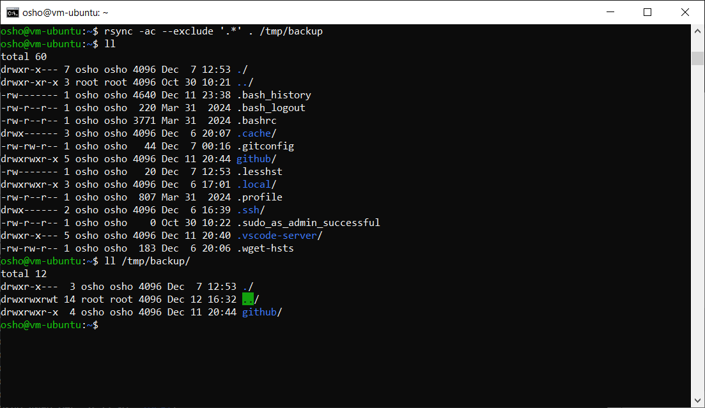
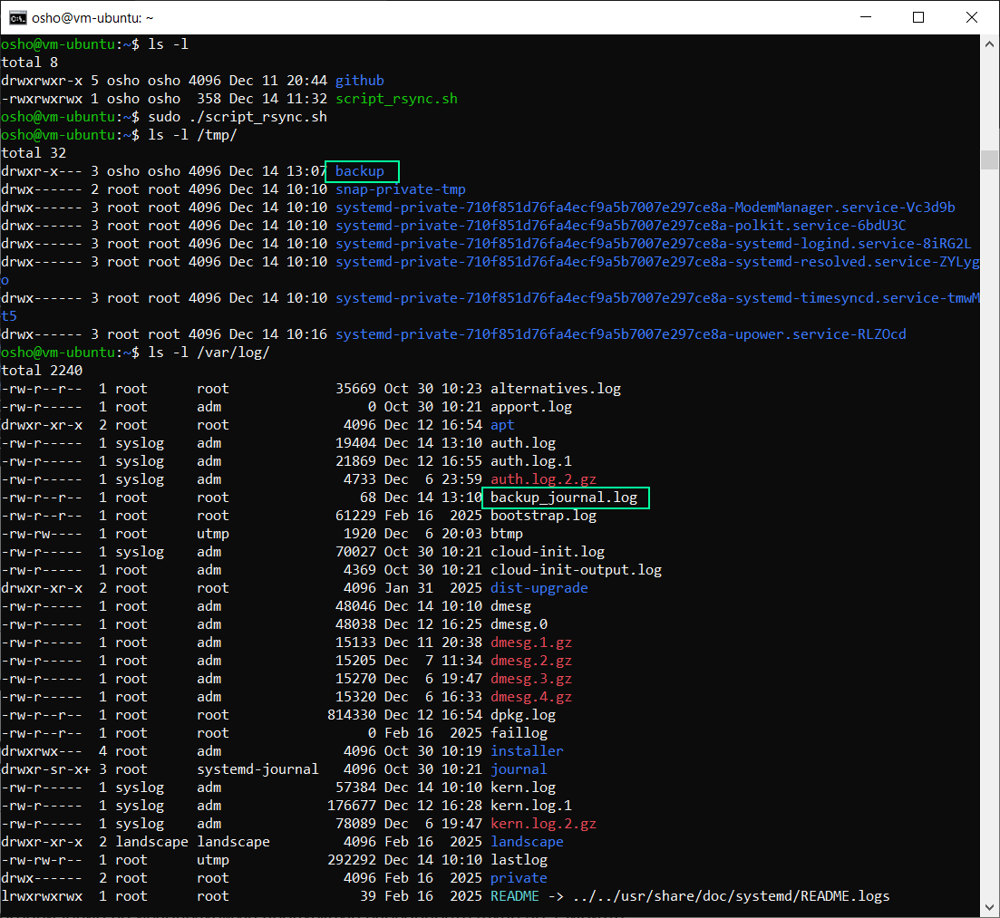
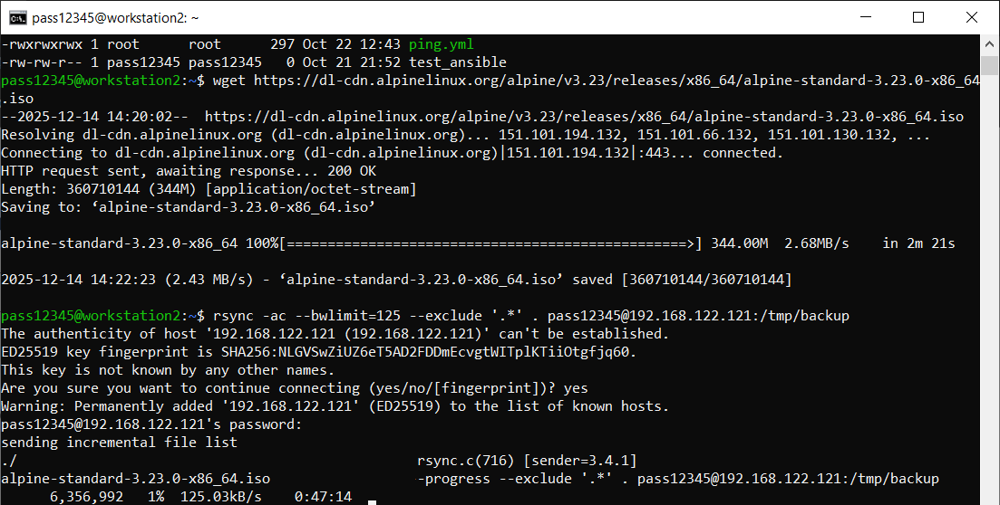
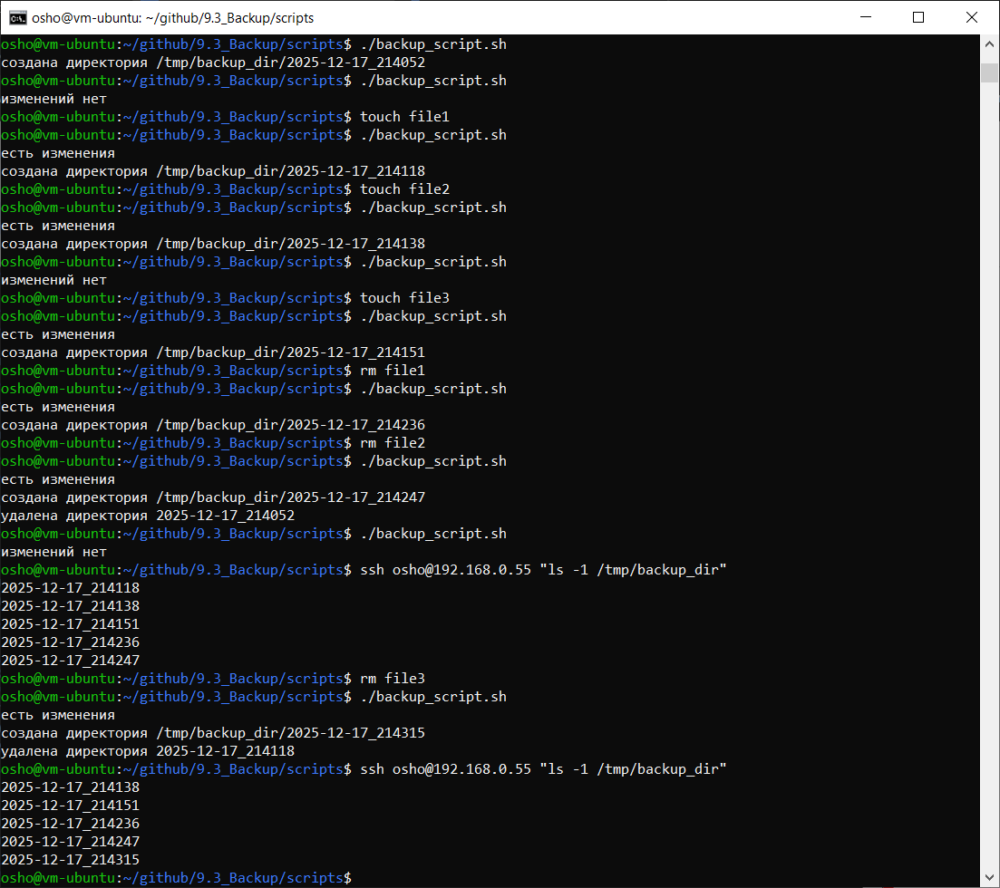

# Домашнее задание к занятию 3 «Резервное копирование»

[Подробное описание решения домашнего задания в GoogleDocs](https://docs.google.com/document/d/1fl3iojGLaqqMvhJjZR7eFqRk2Px3FQ1zCcSdIe2K4w4/edit?usp=drive_link)

---

### Задание 1
- Составьте команду rsync, которая позволяет создавать зеркальную копию домашней директории пользователя в директорию `/tmp/backup`
- Необходимо исключить из синхронизации все директории, начинающиеся с точки (скрытые)
- Необходимо сделать так, чтобы rsync подсчитывал хэш-суммы для всех файлов, даже если их время модификации и размер идентичны в источнике и приемнике.
- На проверку направить скриншот с командой и результатом ее выполнения

### Решение 1

````
rsync -ac --exclude '.*' . /tmp/backup
````



---

### Задание 2
- Написать скрипт и настроить задачу на регулярное резервное копирование домашней директории пользователя с помощью rsync и cron.
- Резервная копия должна быть полностью зеркальной
- Резервная копия должна создаваться раз в день, в системном логе должна появляться запись об успешном или неуспешном выполнении операции
- Резервная копия размещается локально, в директории `/tmp/backup`
- На проверку направить файл crontab и скриншот с результатом работы утилиты.

### Решение 2

[скрипт dayly_backup.sh](scripts/dayly_backup.sh)

[конфигурационный файл crontab](conf/root)




---

### Задание 3
- Настройте ограничение на используемую пропускную способность rsync до 1 Мбит/c
- Проверьте настройку, синхронизируя большой файл между двумя серверами
- На проверку направьте команду и результат ее выполнения в виде скриншота

### Решение 3

````
rsync -ac --bwlimit=125 --progress --exclude '.*' . pass12345@192.168.122.121:/tmp/backup
````


---

### Задание 4
- Напишите скрипт, который будет производить инкрементное резервное копирование домашней директории пользователя с помощью rsync на другой сервер
- Скрипт должен удалять старые резервные копии (сохранять только последние 5 штук)
- Напишите скрипт управления резервными копиями, в нем можно выбрать резервную копию и данные восстановятся к состоянию на момент создания данной резервной копии.
- На проверку направьте скрипт и скриншоты, демонстрирующие его работу в различных сценариях.

### Решение 4

[скрипт для инкрементного резервного копирования](scripts/backup_script.sh)



[скрипт для управления резервными копиями](scripts/recovery.sh)


